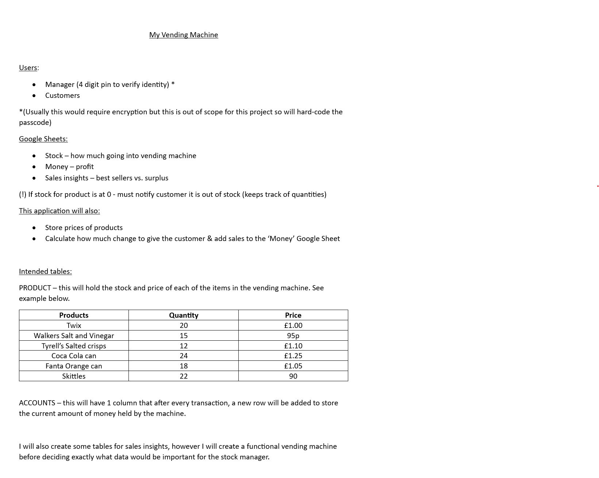

# My Vending Machine

## Plan
Before starting, I have created a short plan to help guide me through this project

## Credits

Leading zeros: https://stackoverflow.com/questions/733454/best-way-to-format-integer-as-string-with-leading-zeros
gspread documentation: https://docs.gspread.org/en/latest/user-guide.html

## Struggles

Issues with updating cells (rather than just adding new rows), found solution in gspread documentation (linked in credits)