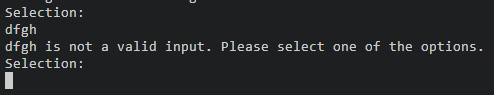

# My Vending Machine
This is a command-line application written in Python. It allows the sales manager of a vending machine to keep
track of stock levels within the vending machine, be able to set and update the available products and update pricing. In addition to this it allows the stock manager to glean market insights, including which products are the most and least selling items, total income from each product (including quantity of each product sold), and which products are low in stock and will need to be refilled. In terms of the financial aspect, it allows the stock manager to keep track of how much money is inside the vending machine and to withdraw money from it on demand. From a customer perspective, its a simple way of getting a tasty snack or beverage instantly.

## Plan
Before starting, I have created a short plan to help guide me through this project

## Important notes
The passcode for the stock manager is `1234`, Usually this would require encryption but this is out of scope for this project so will hard-code the passcode

## Testing
I have set up the product and money tables in this way before testing.  
product table:  
  
money table:  
  
  
When running the code for the first time (after pressing enter to continue), the user is asked which product they are wanting to buy.  
  
If the user provides an invalid input, then they are prompted to give another input. Examples of invalid inputs include, letters instead of numbers.  
  
Number that is not shown in the list of selections  
  
And in addition, any item that is out of stock  
  
  
However, if instead, the user does give a valid input then it asks the user for money, the user presses enter as a proxy for paying, then it dispenses the item and goes back to the selection menu for the next user  
  
Once this happens, the product table is updated to decrease the stock by 1, increase the sales by 1 and increase the income by the product's price  
  
And a new row gets added to the money table with the current balance (calculated as the previous balance + the price of the bought product)  
  
   
Now if the stock manager wants to log in, they have their own option after all of the products, when 7 is selected, it prompts the stock manager to enter their passcode (see Important Notes section). If they enter the wrong code, then they are told it is incorrect and it returns them back to the user screen.  
  
And when they provide the correct passcode, they are taken to the manager screen, where they can choose options to update the stock or prices, take their profits out of the machine, or view sales analytics.  
  
  
If they choose to update stock, they are product-by-product, told the current stock and asked how many they want to add.  
  
And this is reflected in the quantity column of the product table  
  
  
If they choose to update prices, they are product-by-product, told the current prices and asked what they want to update them to, any that is left as an empty line the price is kept the same, and for any invalid inputs, the user is asked to provide another
  
And this is reflected in the price column of the product table  
  
  
If they choose to remove money, they are told the current balance and asked how much they'd like to remove, if they ask for more than the current balance, then they are asked again.  
  
And this is reflected with a new row in the money table.  
  
  
If they ask to see the sales insights, then they are initially asked if they want to see a summary of the data which (one-by-one) includes the most/least profitable products, the most/least selling products, which products have low/no stock and finally the current balance.  
  
Then they are asked if they want to see the entire data. This gives a printed version of all the data within the product table for if they need more detail, this data is given row-by-row each time they hit enter.  

If they choose to return to the user screen, then it returns to the user screen for the next customer.  
  
And finally they can choose to shut the machine down which terminates the program.  
  

### Bugs
I have done extensive testing so am sufficiently happy that this is bug-free. JHowever during coding, there were bugs that I encountered and fixed. 
- It turns out that there were runtime issues because the code was trying to turn the header line into a product object like it does for the rest of the rows. Once figuring out that this was the issue, I ended up making sure that the first row of the table was skipped for this.
- After adding the sales and income colums to the product table, they never updated after a sale. I quickly discovered that the update_product_in_worksheet method was only coded to update the existing quantity and price columns, however this was easily fixed. 

### Python Validator
The code passes the Code Institure Linter Python Validation with zero errors.

## Deployment
This project was deployed using Code Institute's mock terminal for Heroku
- Steps for deployment
    - Fork or clone this repository
    - Create a new Heroku app
    - Set the buildbacks to `Python` and `NodeJS` in that order
    - Link the Heroku app to the repository
    - Click on deploy

## Credits

Leading zeros: https://stackoverflow.com/questions/733454/best-way-to-format-integer-as-string-with-leading-zeros  
gspread documentation: https://docs.gspread.org/en/latest/user-guide.html
Code institute course materials

## Struggles

Creating the initial data structure, in the end I created a class for my Product table that contains a class variable for each of the columns in the table. And then a variable that was a list of Product objects where each item of the list is a row in the table. This did bring challenges to the initial stages of writing the code because there was a lot of setting up that needed to be done and with a lot of thought to exactly the best way to organise everything, however in the end, using object oriented programming it allowed a lot of flexibility so that I could see all of the products to be able to access and update anything I needed fairly easily especially in the sales insights section of the project.

Issues with updating cells, in the example project we only had to add new rows to the bottom of tables, however I needed to modify records directly and did not know how to do this. Thankfully after some web searching, I found the solution to my problem in the gspread documentation (linked in credits)

Part way through the commit for adding the sales insights, I realised that I didn't need a separate sales table as I could just add this data to the existing product table. This did mean adjusting the Product class, however with the way I set up the objects, this actually ended up being simpler than initially thought